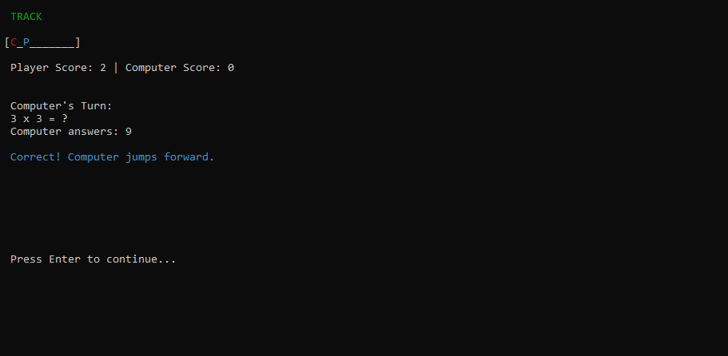
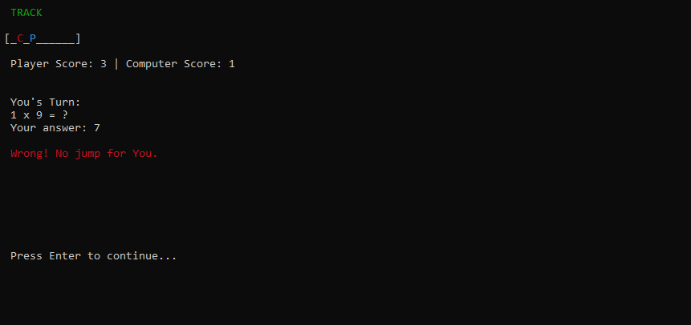
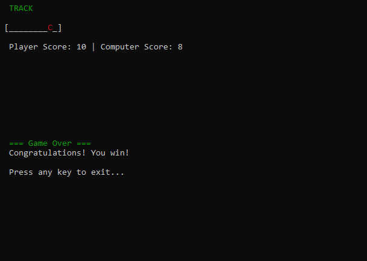
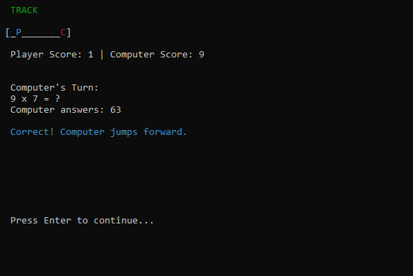

# Penguin Jump Multiplication Race 
## Abstract
Penguin Jump Multiplication Race is a C-based educational game that teaches multiplication and fundamental computer architecture concepts. In this human-vs-computer console race, players move forward on a track by correctly answering multiplication questions. The game uses concepts like register simulation, memory management, control flow, and file I/O to simulate how computers work under the hood.

## Features
-  Multiplication practice
-  Turn-based human vs. computer gameplay
-  Save/Load game state using binary file I/O
-  Simulated registers and memory
-  Console-based visual track display
-  Modular code structure

## Gameplay
- Both players start at position 0 with score 0.
- On each turn, a multiplication question appears.
  - Human answers manually.
  - Computer has a 70% chance to answer correctly.
- A correct answer:
  - Moves the player 1 step forward
  - Grants 1 point
- First to reach position 10 wins!

| Symbol | Meaning         |
|--------|-----------------|
| `P`    | Human Player    |
| `C`    | Computer Player |
| `B`    | Both in same cell |


## Technical Concepts Demonstrated
- Register Simulation: `RegisterSim` struct mimics CPU registers.
- Memory Management: Dynamic allocation with `malloc`, `free`.
- Control Flow: Uses `if`, `else`, and `while` to simulate branching.
- File I/O: Saves/loads game using `fwrite`, `fread`.
- Random Behavior: Uses `rand()` for computer’s probabilistic actions.
- Modular Design: Functions like `initPlayers()`, `playTurn()`, `saveGame()`.
- State Machine: Game behaves as a finite state machine (FSM).

  ## Screenshots
 
| Gameplay in progress | Wrong answer |
|---|---|
|  |  |
 
| Human wins | Computer wins |
|---|---|
|  |  |
 
## Dependencies
- [PDCurses](https://github.com/wmcbrine/PDCurses) (Windows console build)

### Build PDCurses (one-time setup)
```bash
git clone https://github.com/wmcbrine/PDCurses
cd PDCurses/wincon
mingw32-make -f Makefile CFLAGS="-O2 -Wall -I.. -DHAVE_NO_INFOEX"
```
This produces `pdcurses.a` in `PDCurses/wincon`.
 
### Build the game
```bash
gcc "Penguin Jump.c" -o "Penguin Jump.exe" -I<path_to_PDCurses> -L<path_to_PDCurses>/wincon -lpdcurses
```
 
Or in Code::Blocks:
- Add `PDCurses` folder to **Compiler search directories**
- Add `PDCurses/wincon` folder to **Linker search directories**
- Add `pdcurses.a` to **Link libraries**
### Run
Run the built `.exe` directly (double-click or from a terminal), not through the IDE's console runner, to avoid console API conflicts with PDCurses.
```bash
./Penguin Jump.exe
```
 
